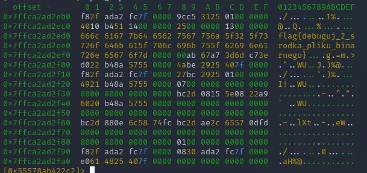

# Dwojkowy
**Category**: reversing \
**Points**: 100

## Description
Mam problemy z binarką, zgubiłem do niej kod źródłowy, a znajdowało się w tam kilka ważnych rzeczy... Możesz mi pomóc?

## Solution
We are given an ELF file which doesn't generate any output. Looking at the assembly in radare2, it seems that it loads some characters to array and then encrypts them in some way. I also noticed that they don't get pushed out of the stack. This sparked an idea in my head to set a breakpoint near the end of binary and dipslay the stack.

```
> db 0x55578ab422c2
> dc
> px @rbp-0x50
```



## FLAG
flag{debuguj_2_srodka_pliku_binarnego}