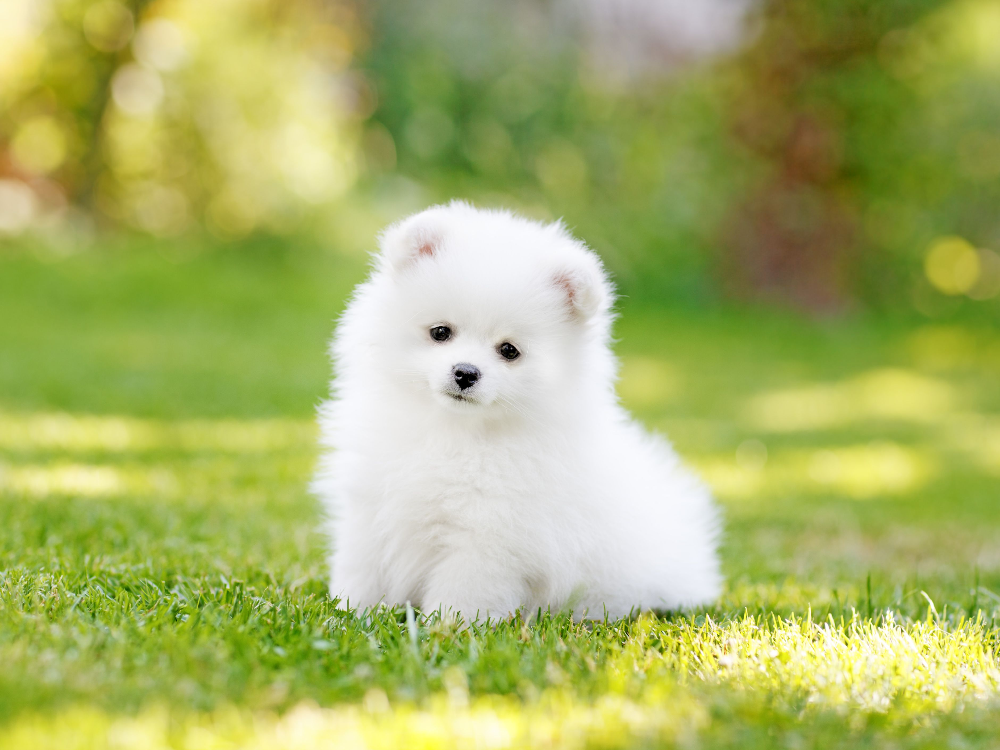

# Kocham Pieski
**Category**: stego \
**Points**: 50

## Description
Dawaj flagi i lecimy w spanko.

## Solution
Attachement to challenge is this lovely picture of a dog:

Running
```
file piesek.jpg
```
reveals a comment, that says "The password is ilovedogs". I dabbled with some tools like LSB, binwalk etc. but didn't get any results. Eventually I found out, that program called "steghide" takes password as an input. I decied to give it a shot. 
```
steghide extract -sf piesek.jpg
```
It extracted a file called "flag.txt" with a flag inside

## FLAG
flag{abcde}