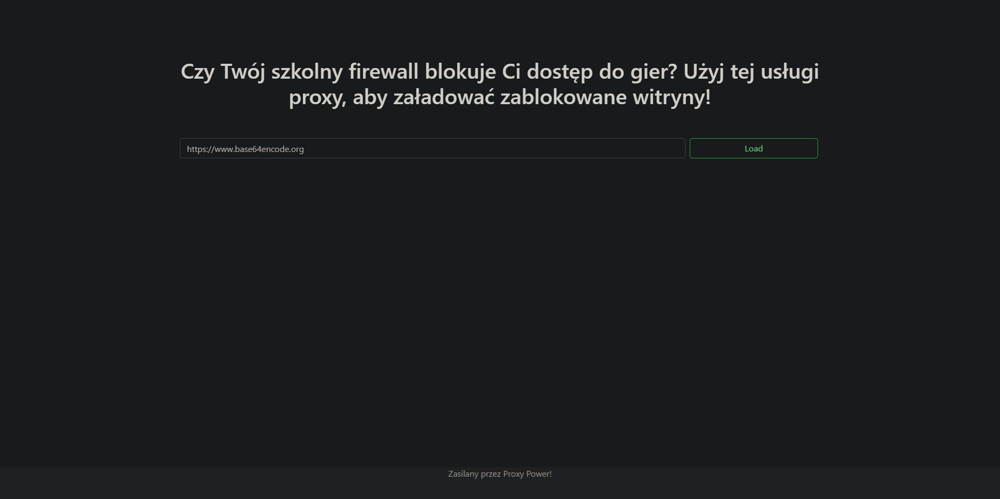

# Proksi
**Category**: web \
**Points**: 100

## Desciption
Czy Twój szkolny firewall blokuje Ci dostęp do gier? Użyj tej usługi proxy, aby załadować zablokowane witryny!

## Solution

The website displays us any website that we provide link to. \
When checking the html source code we can find this comment:
```
<!--
            <span class="text-muted">
                <a href="http://127.0.0.1/server-status">Status</a>
            </span>
            -->
```
Let's try entering http://127.0.0.1/server-status as our link. \
Unfortunately the server tells us that they refuse to load localhost links.

But we can simply get past that by using any url shortener. \
Example url: https://shorturl.at/xDIJQ
And we are in with all the server info! \n
In the requests history we see a lot of
```
GET /reset-password?token=006c1e700d152ac687319b991559d959 HTTP
```
And if we go to that url we get our flag.
## FLAG 
flag{ale jak mnie localhost?}