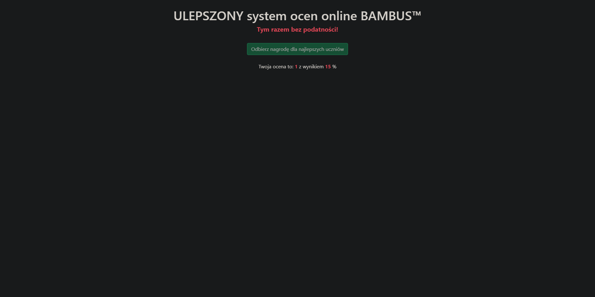

# Średniozaawansowany Bambus
**Category**: web \
**Points**: 100

## Desciption
Nie znam się za bardzo na tym całym JWT

## Solution

Again the very first thing we do is checking cookies and source code. \
This time source code gives us nothing so we decided to give alg: "none" vulnerability a shot.
We copy the token from a cookie, paste it in JWT token debuger ([token.dev](https://token.dev)).
There we change alg from HS256 to none, payload again to:
```
{
  "grade": "6",
  "score": 100,
  "iat": 1638456995
}
```
And leave a dot at the end as blank signature. \
Using our token in cookies gets us a flag!
## FLAG 
flag{alg_none_klasyka_gatunku}